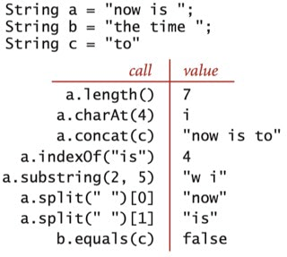

**抽象数据类型（ADT）** 是一种能够对使用者隐藏数据表示的数据类型。使用抽象数据类型时，我们的注意力集中在 API 描述的操作上而不会去关心数据的表示；实现抽象数据类型时，我们的注意力集中在数据本身并将实现对该数据的各种操作。

- 以适用于各种用途的 API 形式准确地定义问题；
- 用 API 的实现描述算法和数据结构。

**特点**：可以在不修改任何用例代码的情况下使用一种算法替换另一种算法并改进所有用例的性能。

## 使用抽象数据类型

### 抽象数据类型的 API

抽象数据类型的定义和静态方法库之间的共同点：
- 两者的实现均为 Java 类；
- 实例方法可以接受 0 个或多个指定类型的参数，由括号表示并由逗号分隔；
- 可能返回指定类型的值。

不同点：
- API 中会出现名称和类名相同的没有返回值的构造函数；
- 实例方法不需要 `static` 关键字，目的是操作数据类型中的值；
- 尊重 Java 习惯而存在的继承方法，在 API 中显示为灰色。

### 继承的方法

大致有 `toString()` 、`equals()` 、`compareTo()` 、`hashCode()`。
在使用 “+” 运算符将任意数据类型的值和 String 值连接时会调用 `toString()` 方法。

### 对象

#### 对象的创建与使用

调用 `new()` 时，系统会：
- 为新的对象分配内存空间；
- 调用构造函数初始化对象中的值；
- 返回该对象中的一个引用。

> 静态方法的主要作用是实现函数；非静态（实例）方法的主要作用是实现数据类型的操作。一个开头是类名，一个开头是对象名。

开发某种给定数据类型的用例：
- 声明该类型变量，以用来引用对象；
- 使用关键字 `new` 触发能够创建该类型的对象的一个构造函数；
- 使用变量名在语句或表达式中调用实例方法。

使用与对象关联的变量：
- 赋值语句；
- 向方法传递对象或是从方法中返回对象；
- 创建并使用对象的数组。

<div id="item"></div>

> **赋值语句** 不会创建对象，而是创建另一个指向某个已经存在的对象的引用。这种情况称为 **别名** ：两个变量同时指向同一个对象。

对于原始数据类型的变量，会发生值的复制。而对于引用类型，复制的是引用而非实际的值。例如：

```java
int a = 0;
int b = a;
b++;
System.out.println(a);
System.out.println(b);
```

此时输出的 a 的值为 0，b 的值为 1。再试着运行下面的程序：

```java
public class Test {
    public static void main(String[] args) {
        Num num = new Num(4);
        Num num2 = num;
        num2.add(2);
        System.out.println(num.getValue());
    }
}

class Num {
    private int value;
    Num(int value) {
        this.value = value;
    }
    int getValue() {
        return value;
    }
    void add(int increment) {
        value += increment;
    }
}
```

这是将对象作为参数的情况。
我们可以发现 `num.value` 的值随着 `num2` 对 `add()` 方法的调用改变了。

?> 方法无法改变原始的引用，但能够改变对象的值。

Java 中的方法只能有一个返回值，如果使用对象的话，实际上就能够返回多个值。

#### 数组与对象

Java 中所有非原始数据类型的值都是对象。这样一来，数组也是对象。

创建一个对象数组：
- 使用方括号语法调用数组的构造函数创建数组；
- 对于每个数组元素，调用它的构造函数创建相应的对象。

Java 中的对象数组实际上是一个由对象的引用组成的数组。如果对象非常大，在移动对象时只需要移动对象的引用，这样大大提高了效率；而对象非常小的时候，每次获取信息都需要通过引用来操作反而降低了效率。

对象的三大关键性质：状态、标识和行为。

一个数据类型的实现所支持的操作：
- 创建对象（创造它的标识）：使用 `new` 关键字触发构造函数并创建对象，初始化对象中的值并返回它的引用。
- 操作对象中的值（控制对象的行为，可能会改变对象的状态）：使用对象关联的变量调用实例方法来对对象中的值进行操作。
- 操作多个对象：创建对象的数组，像原始数据类型的值一样将它们传递给方法或是从方法中返回，只是变量关联的是对象的引用而非对象本身。

## 抽象数据类型举例

### 几何对象

### 信息处理

### 字符串

<div style="text-align: center;">



</div>

## 抽象数据类型的实现

- 实例变量：每个实例变量的声明都需要一个 **可见性修饰符**
- 构造函数
- 实例方法
- 作用域
- API、用例与实现

### 实例变量

如果使用 `public` 修饰的话，根据定义，这种数据类型就不是抽象的了。所以一般不会这么做。

### 构造函数

- 类似于静态方法，能够直接访问变量并且没有返回值；
- 每一个构造函数都会创建一个对象并向调用者返回一个该对象的引用；
- 名称与类型相同；
- 支持重载；
- 如果没有构造函数，将会隐式定义 `0`，`false`，`null` 的默认值（前提是参数没有提供默认值）。

### 实例方法

同静态方法大都是语法上的区别。

### 作用域

- 参数变量：整个方法。
- 局部变量：当前代码段中定义之后的所有语句。
- 实例变量：整个类。

如果实例变量出现二义性，可以使用 `this` 进行区别。

## 更多抽象数据类型的实现

### 维护多个实现

- 通过前缀描述性修饰符进行区别；
- 维护一个没有前缀的参考实现以适用大多数用例的需求。

### 累加器

维护一个 `int` 类型的实例变量来记录已经处理过的数据值的数量，以及一个 `double` 类型的实例变量来记录所有数据之和，除以数据数量得到平均值。

- 实现
```java
public class Accumulator {
    private double total;
    private int N;
    public void addDateValue(double val) {
        N++;
        total += val;
    }
    public double mean() {
        return total / N;
    }
    public String toString() {
        return "Mean (" + N + " values): " + String.format("%7.5f", mean());
    }
}
```

- 用例
```java
public class TestAccumulator {
    public static void main(String[] args) {
        // 如果不想使用终端输入命令的方式，此处也可以改为
        // int T = StdIn.readInt();
        // 如此就可以在输入端输入 T 值
        int T = Integer.parseInt(args[0]);
        Accumulator a = new Accumulator();
        for (int t = 0; t < T; t++) {
            a.addDateValue(StdRandom.random());
        }
        StdOut.println(a);
    }
}
```

- 用法
```shell
$ java TestAccumulator 1000
Mean (1000 values): 0.51829
```

### 可视化的累加器

使用 `StdDraw` 画出所有数据（灰色）和实时平均值（红色）。

- 实现
```java
public class VisualAccumulator {
    private double total;
    private int N;
    public VisualAccumulator(int trials, double max) {
        StdDraw.setXscale(0, trials);
        StdDraw.setYscale(0, max);
        StdDraw.setPenRadius(.005);
    }
    // 副作用：实现绘图
    public void addDateValue(double val) {
        N++;
        total += val;
        StdDraw.setPenColor(StdDraw.DARK_GRAY);
        StdDraw.point(N, val);
        StdDraw.setPenColor(StdDraw.RED);
        StdDraw.point(N, total / N);
    }
    public double mean() {
        return total / N;
    }
    public String toString() {
        return "Mean (" + N + " values): " + String.format("%7.5f", mean());
    }
}
```

- 用例
```java
public class TestVisualAccumulator {
    public static void main(String[] args) {
        int T = Integer.parseInt(args[0]);
        VisualAccumulator a = new VisualAccumulator(T, 1.0);
        for (int t = 0; t < T; t++) {
            a.addDateValue(StdRandom.random());
        }
        StdOut.println(a);
    }
}
```

- 用法
与 `Accumulator` 用法一致。

## 数据类型的设计

- [ ] 省略，待更新

## 补充

- 原始数据类型更接近计算机硬件所支持的数据类型，使用起来要要快于引用类型。
- 有时候会用私有实例方法在公有方法之间共享代码。
- 没有使用 `new` 关键字创建对象得到的 <a title="`cannot find symbol`">错误</a> 与引用一个未定义符号相同，构造函数的参数数量不对也会出现相同的错误信息。
- 创建对象数组每一个对象都需要使用 `new` 关键字：没有创建数组与为一个未初始化的变量赋值得到的 <a title="`variable %s might not have been initialized`">错误</a> 相同。如果尝试调用未初始化对象的方法，会得到 <a title="`NullPointerException`">空指针异常</a> 。
- `println()` 接受一个 `Object` 对象。
- [指针是什么？](https://baike.baidu.com/item/指针 "百度百科")
- 实现引用的一种自然方式是使用指针（机器地址），另一种可能是句柄（指针的指针）。前者访问数据的速度很快，后者能够更好地实现垃圾回收。
- 继承的问题：子类代码可以访问所有实例变量，因此可以改变值。
- 类中的所有方法都可以访问静态变量。静态变量的作用域是全局的，所以使用时要非常小心。
- 不再被支持但为了保持兼容性而留在 API 中的方法叫做被弃用（deprecated）的方法。

## 习题

见 [习题 1-2]() 。
